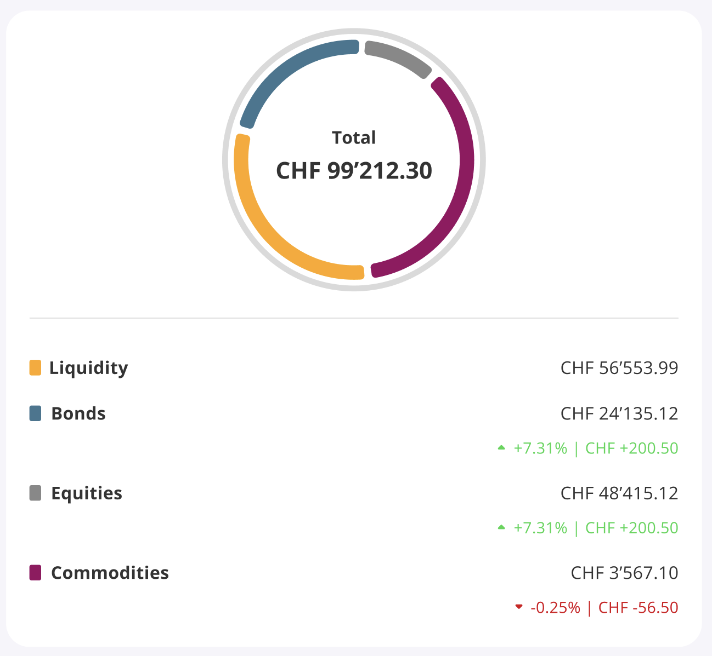

# Use Case Widget Reverse Engineering

## Overview
This document outlines the methodology for reverse engineering widgets and recreating them in code. This process helps in understanding existing implementations and creating compatible or improved versions.

## Process Methodology

### 1. Visual Analysis
- Identify distinct components of the widget
- Note visual properties (colors, sizes, spacing, etc.)
- Observe animations and state transitions
- Document responsive behaviors across different screen sizes

### 2. Functional Analysis
- Identify user interactions (clicks, drags, hovers)
- Map each interaction to resulting behaviors
- Determine data dependencies
- Identify network requests and API interactions

### 3. Code Generation Strategy
- Break complex widgets into smaller components
- Generate base structure first
- Add styling and visual details
- Implement interaction behaviors last
- Test and refine incrementally

## Tips for Effective Results

- **Start simple**: Begin with a minimal implementation and add complexity
- **Use iterative prompting**: Build upon previous responses to refine results
- **Leverage image analysis**: Use image analysis capabilities before requesting code
- **Use the model's vocabulary**: Incorporate terms from the model's analysis in follow-up prompts
- **Focus on one component at a time**: Generate and perfect components individually before combining

## Common Challenges and Solutions

| Challenge | Solution |
|-----------|----------|
| Complex layouts | Break into grid/flex containers |
| Custom animations | Use step-by-step generation of keyframes |
| Responsive behavior | Start with mobile or desktop, then adapt |
| Interactive elements | Focus on state management patterns |

## Example Use Case

Below is an example widget that demonstrates the concepts discussed in this document:

## Links to Experimentation with Different Models

Below are the links to the tests conducted with different models.

Note: the generated code is intended for use in Flutter and Dart and requires an account on 
the [FlutLab](https://flutlab.io/) platform to be run. 
The code is not guaranteed to be functional and may require adjustments.

