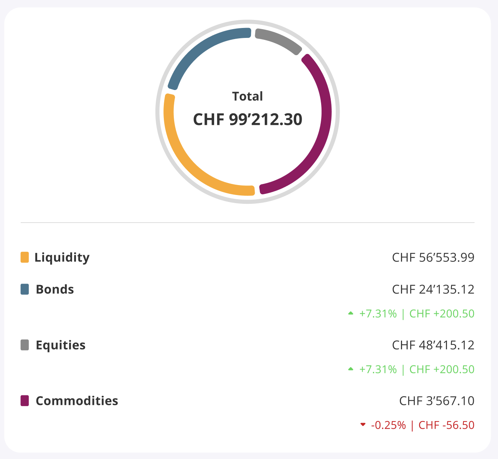

# Reverse Engineering of a Widget

## Objective
Starting from the image of a widget, the goal is to reverse engineer it and recreate it in code. 
This process involves analyzing the widget's visual and functional aspects, generating code, and iteratively refining the implementation.

## Scope Boundaries
The scope of this research is limited to a simple mobile widget, focusing on the visual and functional aspects of the widget. 
The analysis will not cover complex interactions or backend integrations.

## Key Question
Is it possible to reverse engineer a widget from an image and recreate it in code using AI models?

The answer is no, first of all an image is not sufficient to contextualize the work to be done, and then a specialized model is needed for this type of image

## Process Methodology

### 1. Visual Analysis
- Identify distinct components of the widget
- Note visual properties (colors, sizes, spacing, etc.)
- Observe animations and state transitions
- Document responsive behaviors across different screen sizes

### 2. Functional Analysis
- Identify user interactions (clicks, drags, hovers)
- Map each interaction to resulting behaviors
- Determine data dependencies
- Identify network requests and API interactions

### 3. Code Generation Strategy
- Break complex widgets into smaller components
- Generate base structure first
- Add styling and visual details
- Implement interaction behaviors last
- Test and refine incrementally

## Tips for Effective Results

- **Start simple**: Begin with a minimal implementation and add complexity
- **Use iterative prompting**: Build upon previous responses to refine results
- **Leverage image analysis**: Use image analysis capabilities before requesting code
- **Use the model's vocabulary**: Incorporate terms from the model's analysis in follow-up prompts
- **Focus on one component at a time**: Generate and perfect components individually before combining

## Common Challenges and Solutions

| Challenge | Solution |
|-----------|----------|
| Complex layouts | Break into grid/flex containers |
| Custom animations | Use step-by-step generation of keyframes |
| Responsive behavior | Start with mobile or desktop, then adapt |
| Interactive elements | Focus on state management patterns |

## Specification

In the end, all the information collected should be consolidated into a [specification](specifications.md) document that describes the widget in detail.

## Example Use Case

Below is an example widget that demonstrates the concepts discussed in this document:

