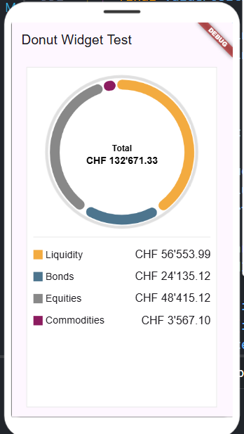

# Reverse Engineering of a Widget

The recognition of the widget image produced a barely sufficient description with ChatGPT using the o3-mini-high model. The subsequent request to produce the widget for Dart/Flutter from the description was successful with 100% functional code, but the layout was quite far from the original.

Note: the generated code is intended for use in Flutter and Dart and requires an account on
the [**FlutLab**](https://flutlab.io/) platform to be run.

[ChatGPT](run-chatgpt.md) code implementation using ChatGPT.

The subsequent attempt to obtain similar code with a local installation based on Ollama and Deepseek-r1:14b led to a very poor result

[Ollama+Deepseek](run-ollama.md) code implementation using Ollama+Deepseek.

The code generation from the specification, with some adjustments made interactively using the vibe coding technique, achieved a result very similar to the original. The Claude 3.7 Sonnet Thinking model, used within Copilot Edits, was able to program the rotation from portrait to landscape of the mobile device with a simple instruction.

