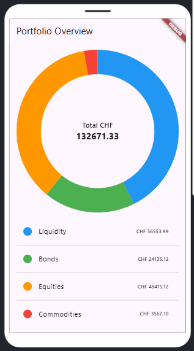

# Widget Reverse Engineering with ChatGPT

Model: o3-mini-high.

Action: load the image.

**Prompt:**
Describe the image.

**Response:**

*Reasoned about image description for 8 seconds* 

*The image appears to be a dashboard or summary screen of an investment or portfolio overview in Swiss francs (CHF). At the top, there is a circular (donut-style) chart labeled “Total CHF 99’212.30,” divided into four color-coded segments. Below the chart, there is a list of four categories, each showing a monetary value and, where applicable, a percentage change and the corresponding gain/loss in CHF:*

1. **Liquidity**: CHF 56’553.99 (no percentage change shown)
2. **Bonds**: CHF 24’135.12, showing a green arrow with +7.31% and CHF +200.50
3. **Equities**: CHF 48’415.12, also showing a green arrow with +7.31% and CHF +200.50
4. **Commodities**: CHF 3’567.10, with a red arrow indicating -0.25% and CHF -56.50

*Each category is color-coded in the chart, and the total at the center (99,212.30 CHF) presumably represents the overall value of the portfolio or assets. The green and red arrows indicate positive or negative performance for the respective categories.*

**Prompt:**
Ok, the image is the display of a mobile app composed, on the top, by a donut-style element, and, at the bottom from a list of categories. I need a flutter implementation of this component, the implementation should use flutter elements.  The generated code should accept an arbitrary list of categories associated with any amount of money. The colors used for the categories should match the colors displayed by the donut. The label in the middle of the chart is the sum of the categories.  

**Response:**

*Reasoned about Flutter implementation design for 30 seconds*

*Below is an example Flutter implementation that displays a donut chart on the top and a list of categories at the bottom. The code defines a simple model for a category (with name, amount, and color), uses a CustomPainter to draw the donut chart (each segment’s sweep angle is proportional to its amount), and shows the total in the center of the donut. The list below shows each category with a matching color indicator and its amount. You can pass an arbitrary list of categories.*

```dart
import 'dart:math';

import 'package:flutter/material.dart';

void main() {
  runApp(MyApp());
}

class Category {
  final String name;
  final double amount;
  final Color color;

  Category({
    required this.name,
    required this.amount,
    required this.color,
  });
}

class MyApp extends StatelessWidget {
  MyApp({Key? key}) : super(key: key);

  // Example list of categories. You can supply any arbitrary list.
  final List<Category> categories = [
    Category(name: 'Liquidity', amount: 56553.99, color: Colors.blue),
    Category(name: 'Bonds', amount: 24135.12, color: Colors.green),
    Category(name: 'Equities', amount: 48415.12, color: Colors.orange),
    Category(name: 'Commodities', amount: 3567.10, color: Colors.red),
  ];

  @override
  Widget build(BuildContext context) {
    return MaterialApp(
      title: 'Donut Chart Dashboard',
      home: Scaffold(
        appBar: AppBar(
          title: const Text('Portfolio Overview'),
        ),
        body: Padding(
          padding: const EdgeInsets.all(16.0),
          child: Column(
            children: [
              DonutChart(categories: categories),
              const SizedBox(height: 20),
              Expanded(child: CategoryList(categories: categories)),
            ],
          ),
        ),
      ),
    );
  }
}

/// A widget that shows a donut chart with the sum at the center.
class DonutChart extends StatelessWidget {
  final List<Category> categories;
  const DonutChart({Key? key, required this.categories}) : super(key: key);

  double get totalAmount =>
      categories.fold(0.0, (sum, category) => sum + category.amount);

  @override
  Widget build(BuildContext context) {
    return AspectRatio(
      aspectRatio: 1, // Keep the widget square
      child: Stack(
        alignment: Alignment.center,
        children: [
          CustomPaint(
            size: Size.infinite,
            painter: DonutChartPainter(categories: categories),
          ),
          // Center label showing the total amount.
          Column(
            mainAxisSize: MainAxisSize.min,
            children: [
              const Text(
                'Total CHF',
                style: TextStyle(fontSize: 16, fontWeight: FontWeight.w500),
              ),
              Text(
                totalAmount.toStringAsFixed(2),
                style: const TextStyle(
                  fontSize: 20,
                  fontWeight: FontWeight.bold,
                ),
              )
            ],
          ),
        ],
      ),
    );
  }
}

/// Custom painter that draws the donut chart.
class DonutChartPainter extends CustomPainter {
  final List<Category> categories;

  DonutChartPainter({required this.categories});

  @override
  void paint(Canvas canvas, Size size) {
    final total =
        categories.fold(0.0, (previous, category) => previous + category.amount);
    if (total == 0) return;

    final strokeWidth = size.width * 0.15; // 15% of the width as stroke width
    final center = Offset(size.width / 2, size.height / 2);
    final radius = (min(size.width, size.height) / 2) - (strokeWidth / 2);
    final rect = Rect.fromCircle(center: center, radius: radius);

    double startAngle = -pi / 2; // Start from the top (12 o'clock)
    final paint = Paint()
      ..style = PaintingStyle.stroke
      ..strokeWidth = strokeWidth
      ..strokeCap = StrokeCap.butt;

    // Draw each segment.
    for (final category in categories) {
      final sweepAngle = (category.amount / total) * 2 * pi;
      paint.color = category.color;
      canvas.drawArc(rect, startAngle, sweepAngle, false, paint);
      startAngle += sweepAngle;
    }
  }

  @override
  bool shouldRepaint(covariant CustomPainter oldDelegate) => false;
}

/// A widget that displays the list of categories with their colors and amounts.
class CategoryList extends StatelessWidget {
  final List<Category> categories;
  const CategoryList({Key? key, required this.categories}) : super(key: key);

  @override
  Widget build(BuildContext context) {
    return ListView.separated(
      itemCount: categories.length,
      separatorBuilder: (context, index) => const Divider(),
      itemBuilder: (context, index) {
        final category = categories[index];
        return ListTile(
          leading: Container(
            width: 20,
            height: 20,
            decoration: BoxDecoration(
              color: category.color,
              shape: BoxShape.circle,
            ),
          ),
          title: Text(category.name),
          trailing: Text('CHF ${category.amount.toStringAsFixed(2)}'),
        );
      },
    );
  }
}
```
#### How It Works
1. **Category Model**:
The Category class holds the name, amount, and color for each category.

2. **DonutChart Widget**:
This widget uses a CustomPaint to render the donut chart. The painter (DonutChartPainter) calculates the sweep angle for each segment based on its proportion of the total amount. The total is displayed in the center.

3. **DonutChartPainter**:
The painter draws each segment of the donut by iterating through the category list, calculating each segment’s sweep angle, and drawing an arc with the specified color.

4. **CategoryList Widget**:
Displays a list of categories using a ListView. Each list item shows a small colored circle (matching the donut chart color), the category name, and its amount.

*You can easily adapt or extend this code for different data sets or visual styles as needed.*

## Code Runned on FlutLab

- 

