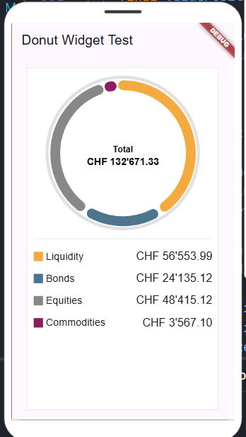
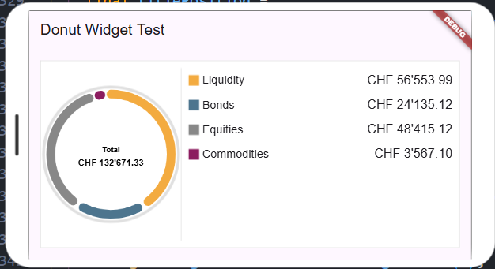

# Use Cases Strategy

## Automated Testing

## Environment Automation

### Use Case Java Dependencies Update

The first step is to create a specification for the agent. The specification should include the requirements, components, and process for the agent. The specification should be clear and concise, and it should provide enough information for the agent to understand what it needs to do.

The second step is let generate the code for the agent. The agent used to generate the code should allow to specify the LLM to be used, the configuration file, and the file to be updated. 
The agent should also allow to specify the provider to be used (e.g. Azure OpenAI or Anthropic) and the configuration file to be used.
Additionally, the agent should be able to work with a set of files, at least 10.

Candidates are Claude Coding, GitHub Copilot (as plugin in Intellij or Visual Studio Code), Aider.

The subsequent steps allow refining both the specifications and the result, always using commands formulated to the agent responsible for code generation.

See also [AI Agents Prototypes](../agents/readme.md)

## Image Analysis

### Use Case Reverse Engineering of a Widget

To achieve a good result, simplicity is the best tool. If we are dealing with a complex representation, it is advisable to analyze and generate the code for each part separately. Subsequently, the codes can be recombined to recreate the complex surface.

Similarly, with the prompt, it is better not to insist on too many details. An essential request generally leads to a better initial structure. Details omitted can later be added with subsequent improvements through prompts.

The first step is to ask the model for an analysis of the image. The response provides the starting point for generating the code. It is important to use expressions and words from the model's response to formulate the request that generates the code.

See [research/use-case-widget-reverse-engineering/description.md](research/use-case-widget-reverse-engineering/description.md) for a detailed description of the use case.

#### Results

Testing the described strategy does not lead to good results without many corrections. The limitations are in the image, even the best language model does not have the ability to extract all the information that a person immediately sees. Furthermore, there are no reliable models for low-cost local processing. We conclude that this is not a good strategy for working with artificial intelligence.

The final test using a document specifying all the characteristics of the widget has proven to be a better and more reliable strategy. Subsequent corrections have always concerned details that were forgotten or poorly evaluated when the specification was written.

[Specification](specification.md) is a document that describes the widget in detail. The document is not intended to be used as a prompt, but rather as a reference for the model to understand the widget's characteristics and behavior. The document is not exhaustive and does not cover all possible cases, but it provides a good starting point for generating the code.

[Widget Code](widget_code.dart) is the code generated by the model based on the specification. The code is not guaranteed to be functional and may require adjustments. The code is intended for use in Flutter and Dart and requires an account on the [FlutLab](https://flutlab.io/) platform to be run.

[Widget Test](widget_test.dart) is the test code generated by the model based on the widget code. The test code is not guaranteed to be functional and may require adjustments. The test code is intended for use in Flutter and Dart and requires an account on the [FlutLab](https://flutlab.io/) platform to be run.

## Legacy Code Modernization

## Pull Request Verification
